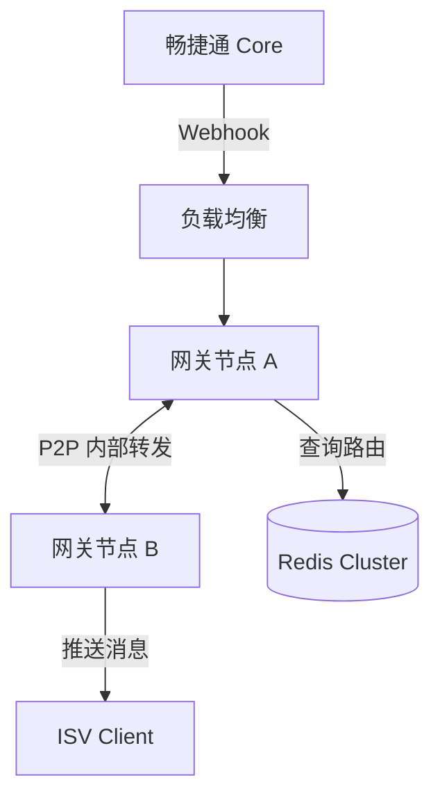
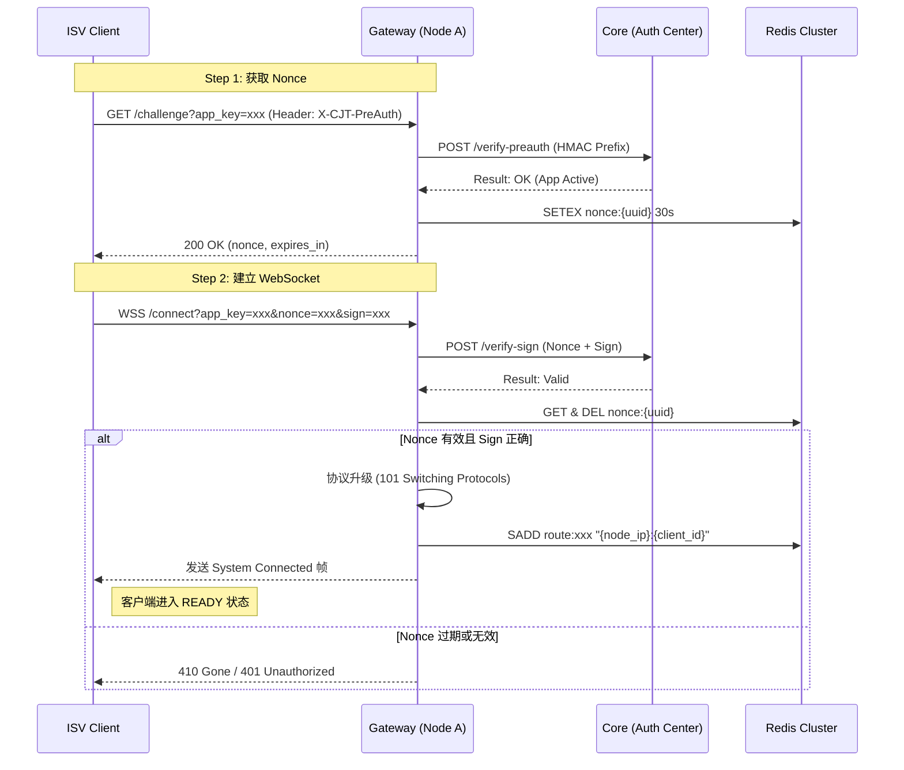
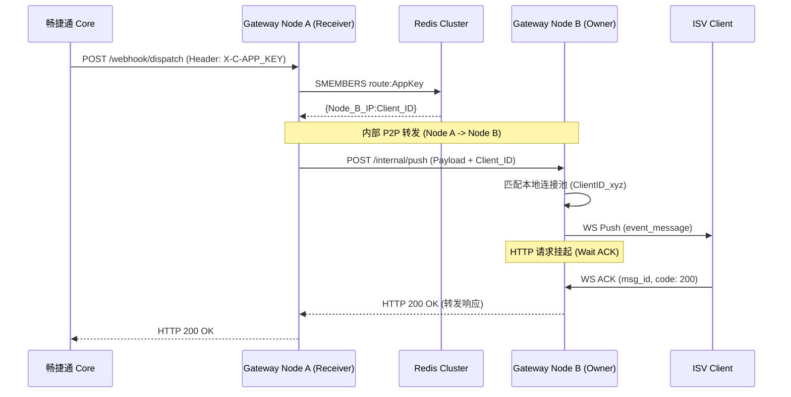
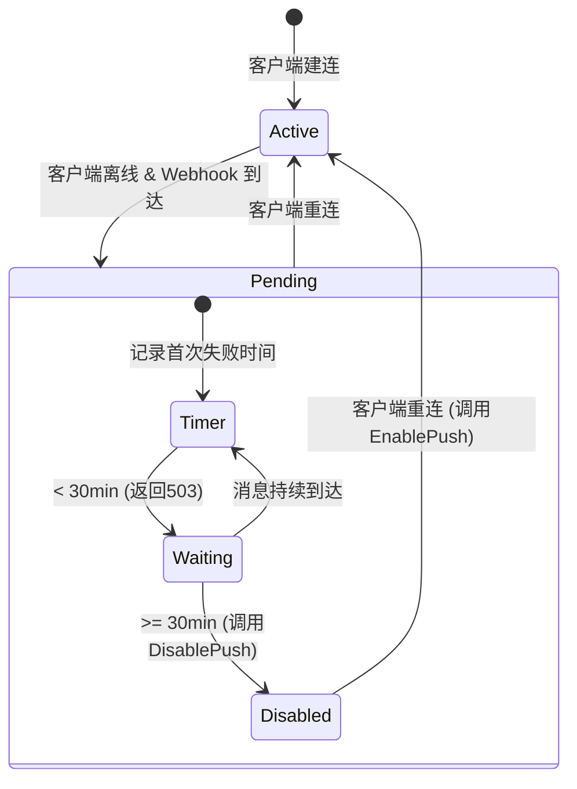
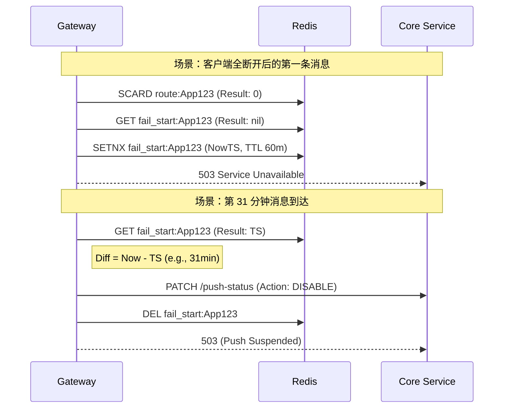
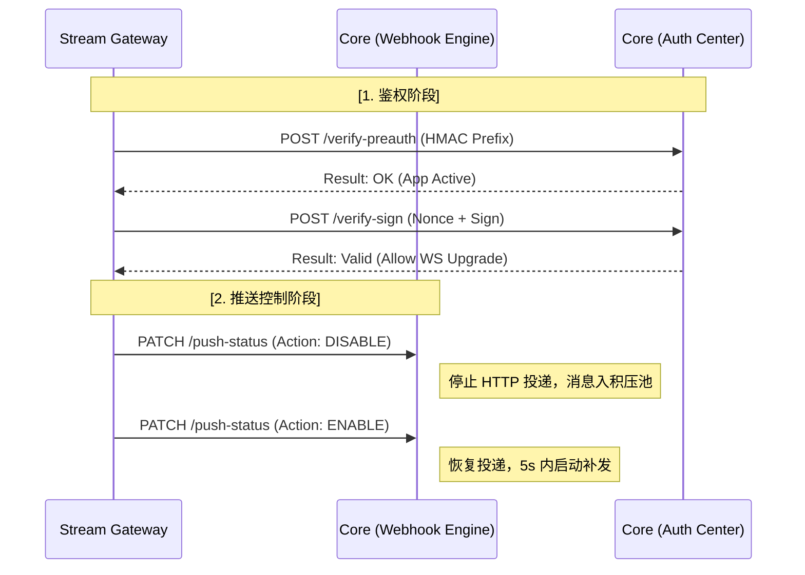

# 畅捷通 Stream Gateway 产品需求文档 v0.1.0

| 维度 | 内容 |
| --- | --- |
| **文档状态** | 正式版（基于 v0.0.1 ~ v0.0.5 草案整合） |
| **版本** | v0.1.0 |
| **整合草案** | v0.0.1（基础架构）/ v0.0.2（负载均衡与自愈）/ v0.0.3（握手协议与幂等）/ v0.0.5（在线鉴权与动态推送控制） |
| **Core 协作项** | Webhook Header 增加 X-MSG-ID；Core 重试复用 trace_id；在线验证 API；推送状态控制 API |

---

## 1. 背景与产品定位

### 1.1 核心痛点

- **网络限制**：ISV 接入 Webhook 必须具备公网 IP 和 SSL，内网/本地环境接入困难。
- **安全风险**：开放公网端口存在被攻击风险，容易遭受恶意扫描和攻击。
- **接入复杂**：Webhook 签名校验与 URL 自动验证对开发者门槛较高。
- **调试成本高**：本地开发环境无法直接接收外网 Webhook，需依赖内网穿透工具。

### 1.2 产品定位

作为畅捷通开放平台的官方基础设施组件，提供 **Webhook-to-WebSocket 透明同步桥接** 能力。实现"免公网 IP、免证书、高安全、低延迟"的事件订阅体验。

- **对畅捷通 Core**：零代码侵入，Core 依然认为是向一个普通的 URL 发送 Webhook。
- **对 ISV 客户端**：无需公网 IP，只需主动发起 WebSocket 连接即可安全、实时地接收业务事件。

---

## 2. 核心架构设计原则

本组件的设计严格遵循以下原则：

1. **零信任与透明转发 (Zero Trust & Transparent)**：网关**绝对不接触、不存储、不解密**业务明文数据。网关仅负责搬运原始 HTTP 报文（Headers + Raw Body）。`AppSecret` 永远不离开客户端本地，验签逻辑由客户端完成。
2. **绝对无状态 (Stateless Proxy)**：网关内部**不设消息队列，不持久化业务数据**。消息的可靠性投递完全依赖畅捷通 Core 原生的 Webhook 衰减重试机制。
3. **去中心化路由 (Decentralized Routing)**：不依赖 L7 负载均衡（如 Nginx 一致性哈希），网关集群通过轻量级 Redis 注册表实现节点间的 P2P 动态路由。
4. **极速自愈 (Fast Self-Healing)**：摒弃传统的 TTL 等待机制，采用"网关主动剔除"与"客户端高频心跳"结合，实现毫秒级故障转移。

### 2.1 同步阻塞桥接模式 (Synchronous Bridge)

- **无状态代理**：网关不设消息队列，不持久化业务数据。
- **状态回传**：网关挂起 HTTP 请求，等待 WebSocket 客户端的 ACK。
- **压力回传**：若客户端离线或处理超时，网关向畅捷通 Core 返回 `503/504`，利用上游原生的 **Webhook 衰减重试机制** 实现消息积压与重补。

### 2.2 P2P 动态路由机制

- **路由注册表（Redis Cluster）**：使用 Redis 存储 `route:{AppKey} → Set{node_ip:client_id}` 的映射（TTL 60s）。
- **分布式路由**：
    1. Webhook 随机打到任一 Node。
    2. 该 Node 查询 Redis 获知客户端连接所在的物理节点与连接标识。
    3. 通过内部 P2P HTTP 转发报文至目标节点。
- **分散接入 (Dispersed Access)**：建议 ISV 部署多个客户端实例，通过基础设施负载均衡分散连接到不同网关节点，消除单点故障。

### 2.3 核心流转时序 (同步阻塞模式)

1. **建连与注册**：客户端连入 Node A，Node A 在 Redis 写入路由 `route:{AppKey} → {Node_A_IP:Client_ID}`。
2. **接收与寻址**：Core 发送 Webhook 被随机打到 Node B。Node B 查 Redis 得知目标在 Node A。
3. **内部转发**：Node B 向 Node A 发起内部 HTTP 请求，并**挂起等待**。
4. **下发与确认**：Node A 将报文通过 WS 推给客户端，并**挂起等待**。客户端本地验签处理后，通过 WS 返回 `ACK`。
5. **链路释放**：Node A 收到 ACK → 响应 Node B (HTTP 200) → Node B 响应 Core (HTTP 200)。
6. **异常重试**：链路中任何一环超时或断开，Node B 均向 Core 返回 `503/504`，触发 Core 的原生衰减重试。

---

## 3. 负载均衡与分发策略

### 3.1 职责划分

- **基础设施层 (L4/L7 LB)**：负责客户端（Connector）到网关节点（Node）的物理连接分发，采用 **Least Connections** 策略。
- **应用逻辑层 (Gateway Internal)**：负责消息到具体客户端实例的逻辑分发。

### 3.2 双层公平分发算法

1. **跨节点分发 (Cross-Node)**：当 Webhook 到达非目标节点时，网关从 Redis Set 中**随机/轮询**选择一个目标 Node 进行内部转发。
2. **节点内分发 (Intra-Node)**：当目标 Node 本地存在多个属于同一 AppKey 的连接时，采用 **Round-Robin (轮询)** 算法选择一个连接进行推送。

---

## 4. 握手与鉴权协议（在线验证模式）

### 4.1 设计背景

- 网关节点**不存储 AppSecret**（No-Secret 模式），极大提升安全性。
- 不强制要求 ISV 同步时钟，采用 **Nonce 挑战-应答机制**，完全不依赖客户端时钟。
- 由网关实时请求 Core 服务完成在线签名校验。

### 4.2 两步握手流程

#### Step 1 — 获取 Nonce

**请求**：`GET /challenge?app_key={AppKey}`

**Header**: `X-CJT-PreAuth: {HMAC_SHA256(app_key, AppSecret).hex().toLowerCase()[:16]}`

网关行为：调用 Core `verify-preauth` 接口，验证通过后下发 Nonce（30s TTL）。

**Response 200**:

```json
{
  "nonce": "r4nd0m-f8a2-4b1c-9e3d-0c7f6a5b",
  "expires_in": 30
}
```

#### Step 2 — WebSocket 建连

`wss://gateway.cjt.com/connect?app_key={AppKey}&nonce={nonce}&sign={sign}&client_id={client_id}`

- **sign 计算**: `HMAC_SHA256(app_key + "&" + nonce, AppSecret).hex().toLowerCase()`

网关行为：调用 Core `verify-sign` 接口进行最终身份确认。

#### Step 3 — 建连成功确认帧（网关 → 客户端）

```json
{
  "msg_type": "system",
  "event": "connected",
  "client_id": "{client_id}",
  "server_time": 1704067200123,
  "ping_interval": 10000
}
```

_注：客户端收到 connected 帧后才进入就绪状态。_

### 4.3 鉴权参数说明

| 参数 | 类型 | 必须 | 说明 |
| --- | --- | --- | --- |
| **app_key** | string | 是 | ISV 应用标识，用于查询路由表 |
| **nonce** | string | 是 | 从 /challenge 获取，30s TTL，单次有效 |
| **sign** | string | 是 | HMAC_SHA256 签名结果 |
| **client_id** | string | 是 | 客户端自生成并持久化。建议：`{app_key}{hostname}{pid}` |
| **X-CJT-PreAuth** | Header | 是 | HMAC 前 16 位，防 Nonce 获取接口被 DoS 攻击 |

### 4.4 /challenge 安全防护

1. **静态门槛**：无 AppSecret 无法构造 `X-CJT-PreAuth`，切断攻击路径。
2. **频率限制**：同一 AppKey 10次/分钟；同一 IP 20次/分钟。
3. **熔断机制**：同一 IP 5 分钟内 sign 校验失败 >= 5 次，封禁 30 分钟。
4. **密钥强度**：AppSecret 的长度和强度规则由 Core 服务统一制定和校验。

### 4.5 握手错误码

| 接口 | 状态码 | 触发条件 | 客户端行为 |
| --- | --- | --- | --- |
| /challenge | 403 | AppKey 不存在/已禁用 | 不重试，告警 |
| /challenge | 429 | 频率超限 | 读 Retry-After，退避重试 |
| WS Upgrade | 401 | sign 校验失败 | **停止重试**，检查密钥 |
| WS Upgrade | 410 | nonce 过期 | **重新调用 /challenge** |
| WS Upgrade | 503 | 网关节点过载 | 退避重试，LB 自动切节点 |

### 4.6 灰度兼容与 URL 自动校验

- **配置地址**：ISV 在畅捷通后台配置统一的网关接收地址（对内 Dispatch 路径）：`https://stream.chanjet.com/internal/v1/webhook/dispatch`
- **身份标识**：`app_key` 将通过 HTTP Header `X-C-APP_KEY` 携带，无需在 URL 中配置。
- **自动过审**：当 Core 发起 `GET` 校验请求时，网关直接按照 `12.3` 节定义的成功规范代为返回校验成功（如提取 `check_code` 直接返回或返回 `200 OK` ），实现免配置自动校验。

---

## 5. WebSocket 消息协议

### 5.1 推送消息（Gateway → Client）

网关仅透传 Header 白名单字段：`X-C-APP_ID`, `X-C-APP_KEY`, `X-C-ORG_ID`, `Content-Type`, `X-MSG-ID`。

```json
{
  "msg_type": "event",
  "msg_id": "UUID-v4",
  "trace_id": "t-20240101-xxx",
  "timestamp": 1704067200000,
  "headers": {
    "X-C-APP_ID": "app_xxx",
    "X-C-APP_KEY": "cjt_live_xxxxx",
    "X-C-ORG_ID": "org_zzz",
    "Content-Type": "application/json; charset=utf-8",
    "X-MSG-ID": "msg_abc123"
  },
  "payload": "{\"event_type\":\"order.paid\",\"data\":{...}}"
}
```

> **payload 必须为 string**：保证签名可验证性（防止 JSON 序列化改变 Key 顺序），支持非 JSON 格式。

### 5.2 ACK 应答协议（Client → Gateway）

客户端在接收到 `msg_type: "event"` 的推送消息后，必须在 **3 秒内** 通过原 WebSocket 连接返回 ACK 帧。

```json
{
  "msg_type": "ack",
  "msg_id": "UUID-v4",
  "code": 200,
  "message": "success",
  "timestamp": 1704067200500
}
```

**字段说明**：

| 字段 | 类型 | 必须 | 说明 |
| --- | --- | --- | --- |
| **msg_type** | string | 是 | 固定为 `"ack"` |
| **msg_id** | string | 是 | **关键字段**。必须引用推送消息中的 `msg_id`，用于网关关联挂起的 HTTP 请求 |
| **code** | int | 是 | 业务处理状态码。**200**：成功；**4xx**：请求错误；**5xx**：系统错误 |
| **message** | string | 否 | 辅助说明信息，如错误原因 |
| **timestamp** | long | 是 | 13 位毫秒级时间戳 |

### 5.3 ACK 处理规则与超时机制

1. **引用一致性**：网关内部维护一个"待确认消息表"。客户端返回的 `msg_id` 若无法匹配任何活跃的挂起请求，网关将直接丢弃该 ACK 帧。
2. **3 秒硬超时**：
    - 从网关发出 WS 消息开始计时，若 3 秒内未收到该 `msg_id` 的有效 ACK，网关将立即释放对应的 HTTP 请求。
    - 网关向 Core 返回 `HTTP 504 Gateway Timeout`。
    - 网关向客户端发送 `system:timeout` 指令（可选），告知该消息已失效。
3. **单连接顺序性**：虽然 WebSocket 支持异步交互，但为了降低 ISV 实现复杂度，网关建议客户端按接收顺序依次返回 ACK，避免长耗时任务阻塞连接。

### 5.4 ACK 映射关系

网关根据收到的 `code` 字段，决定向畅捷通 Core 返回何种响应：

| 客户端 ACK code | 网关响应 Core 状态码 | 网关响应 Core Body | 核心决策 (Core) |
| --- | --- | --- | --- |
| **200** | `200 OK` | `{"result":"success"}` | **停止重试** |
| **4xx / 5xx** | `503 Service Unavailable` | `{"result":"error", "message":"client_err"}` | **触发衰减重试** |
| **超时 (无 ACK)** | `504 Gateway Timeout` | `{"result":"error", "message":"ack_timeout"}` | **触发衰减重试** |
| **连接断开** | `503 Service Unavailable` | `{"result":"error", "message":"conn_lost"}` | **触发衰减重试** |

> 网关作为透明桥接层，只有客户端返回 `code: 200` 才视为成功确认，其余一律触发 Core 侧衰减重试，保证数据投递的绝对可靠性。

### 5.5 心跳协议

- 网关每 **10s** 发送 `ping` 帧。
- 客户端须在 **5s** 内回 `pong`。
- **20s** 未收到任何交互则断开连接并触发重连。

---

## 6. 动态推送控制（失败触发 30min 容忍期）

### 6.1 核心逻辑 (Push-on-Demand)

1. **重试容忍期**：当 Webhook 到达且无在线连接时，网关在 Redis 记录 `fail_start:{AppKey}` = 当前时间。
2. **503 阶段**：若 `当前时间 - fail_start < 30分钟`，网关向 Core 返回 **503**，利用 Core 侧重试队列暂存消息。
3. **触发禁用**：若 `当前时间 - fail_start >= 30分钟`，网关调用 Core `DisablePush` 接口挂起投递，并清理计时器。
4. **即时恢复**：当 AppKey 的任一客户端重连，网关立即请求 Core `EnablePush` 恢复投递并补发。

---

## 7. 消息幂等策略

### 7.1 重复消息来源

- **A**: ACK 超时，Core 触发重试（高频）。
- **B**: 消息已送达但回包丢失（偶发）。
- **C**: 节点切换瞬间多实例重复推（低频）。

### 7.2 网关层去重（可选）

使用 `dedup:{X-MSG-ID}` 写入 Redis，TTL 10 分钟。命中则直接返回 200。

### 7.3 客户端层幂等（必须实现）

**标准处理流程：**

1. **查幂等表**：基于 `X-MSG-ID` 判断是否处理过。
2. **执行业务**：本地落盘/处理。
3. **标记已处理**：更新幂等状态。
4. **发送 ACK**。

---

## 8. 可靠性与自愈机制 (Resilience)

### 8.1 极致自愈 (Self-Healing)

- **见死即埋 (Active Eviction)**：内部转发若遇连接拒绝（ECONNREFUSED），转发节点**立刻删除** Redis 中的失效路由并返回 503，不等待 TTL 过期。
- **心跳挑战 (Health Check Challenge)**：客户端每 10s 发起 Ping。若 20s 未收到网关 Pong，立刻断开并重新发起建连（覆盖旧路由）。

### 8.2 优雅降级与背压控制

- **内存级并发保护**：
    - **节点级**：限制单机总挂起请求数（如 5000），防止 OOM。超限直接返回 503。
    - **租户级**：限制单 AppKey 在单机并发数（如 100），防止"吵闹邻居"干扰。超限返回 429。
- **宏观熔断器 (Redis)**：若某 AppKey 连续超时/失败达阈值（如 50 次），在 Redis 标记熔断（TTL 60s），网关最外层入口直接拦截，保护集群免受无效流量冲击。

---

## 9. 客户端重连退避协议

### 9.1 退避公式

`wait = min(cap, base × 2^attempt) + jitter`

- `base` = 1000ms, `cap` = 60000ms, `jitter` = 0~30%。

### 9.2 ISV 强制规则

- **禁止立即重连**：onClose 不得直接 connect。
- **必须包含 Jitter**：打散惊群效应。
- **401/403 禁止重连**：必须人工介入。
- **稳定重置**：连接稳定 **60s** 后 attempt 计数归零。

---

## 10. Redis 宕机降级策略

### 10.1 基础设施

生产环境采用 **Redis Cluster** 分片集群。

### 10.2 降级行为

- **路由表**：Redis 不可用时降级读 **本地内存缓存**（TTL 60s）。
- **Nonce**：拒绝新建连，返回 503。
- **去重/限流**：降级为节点内存级控制，允许少量重复。

### 10.3 恢复重建

Redis 恢复后，各节点立即将内存中的活跃连接重新全量同步至 Redis，完成后再开放新建连请求。

---

## 11. 模块解耦与演进设计

### 11.1 逻辑分离，物理合一

- **代码模块化**：严格分离 `HttpReceiver` (HTTP接收)、`WsManager` (WS管理) 与 `Router` (路由) 逻辑。
- **对称部署 (Phase 1)**：初期采用全功能节点模式，资源利用率最高。
- **非对称部署 (Phase 2)**：未来流量剧增时，通过启动参数拆分为"无状态 HTTP 负载层"与"重状态 WS 连接层"，实现微服务化平滑演进，代码无需重写。

---

## 12. RESTful 接口规范

### 12.1 统一响应结构

```json
{
  "code": "GW-0000",
  "message": "success",
  "trace_id": "...",
  "data": { ... }
}
```

### 12.2 对外接口

- `GET /v1/ws/challenge`: 获取 Nonce（详见第 4 章握手协议）。

### 12.3 对内接口 — 接收 Core Webhook 推送 (Dispatch)

- **接口路径**：`POST /internal/v1/webhook/dispatch`
- **Header 要求**：必须包含 `X-C-APP_KEY` (存放 AppKey)，网关据此路由。

- **Response 行为规范**：

| 客户端 ACK 状态 | 网关返回 HTTP 状态码 | 网关返回 Body | Core 侧行为 |
| --- | --- | --- | --- |
| **200 (OK)** | 200 OK | `{"result":"success"}` | **停止重试** |
| **4xx (Client Err)** | 503 Service Unavailable | `{"result":"error", "message":"client_4xx"}` | **触发重试** |
| **5xx (Server Err)** | 503 Service Unavailable | `{"result":"error", "message":"client_5xx"}` | **触发重试** |
| **超时 (3s)** | 504 Gateway Timeout | `{"result":"error", "message":"timeout"}` | **触发重试** |
| **离线 (No Client)** | 503 Service Unavailable | `{"result":"error", "message":"no_online_client"}` | **触发重试** |

### 12.4 ISV 快速 ACK 原则

- ISV 客户端收到消息后，应立即存入本地队列或数据库（持久化），然后立刻返回 `code: 200` 的 ACK。
- **严禁**在返回 ACK 前执行复杂的业务逻辑、远程调用或大事务操作，以防触发网关的 3 秒超时限制。
- 若客户端因处理过慢导致网关超时（504），Core 会随后发起重试。客户端必须利用 `headers` 中的 `X-MSG-ID` 进行业务去重。

---

## 13. 运维与可观测性

### 13.1 全链路 Trace

- 透传 `trace_id` 记录网关内的流入、转发、推送、ACK 全生命周期日志，**不记录业务明文**。

### 13.2 审计流水

- **连接流水**：记录 `client_id` 建连/断开原因、IP。
- **消息流水**：记录 `X-MSG-ID`、`trace_id`、状态、耗时。**不记录业务 Payload**。

### 13.3 监控指标

| 指标 | 阈值 |
| --- | --- |
| 单 AppKey 并发数 | 80 |
| P99 处理耗时 | 3s |
| 节点连接总数 | 4000/5000 |

### 13.4 部署要求

1. **无状态部署**：Gateway Node 节点完全无状态，支持 Docker/K8s 随时横向扩缩容。
2. **内部网络互通**：集群内的 Node 节点必须在同一 VPC 内，且互相开放内部转发端口（如 9001）。
3. **Redis 依赖**：仅需极低配置的 Redis 实例（仅用于存储极少量的路由 String 和熔断标记）。
4. **可观测性**：必须记录结构化日志，包含 `trace_id`, `app_key`, `latency_ms`, `status`。

---

## 14. 跨团队协作：畅捷通 Core 服务配套改造需求

### 14.1 身份验证 API (Auth Provider)

Core 需提供内网高性能接口供网关校验（P99 < 50ms）：

- **验证 PreAuth 前缀**
  - **用途**：网关在处理 `/challenge` 接口时，初步过滤非法请求。
  - **接口**：`POST /internal/v1/auth/verify-preauth`
  - **参数**：
    ```json
    {
      "app_key": "string",
      "pre_auth_prefix": "string(16位)"
    }
    ```
  - **逻辑**：Core 检索 Secret，计算 HMAC 后对比前 16 位。响应需包含 App 状态（禁用/欠费等）。

- **验证 WebSocket 签名**
  - **用途**：WebSocket 建连时的最终身份确认。
  - **接口**：`POST /internal/v1/auth/verify-sign`
  - **参数**：
    ```json
    {
      "app_key": "string",
      "nonce": "string",
      "sign": "string"
    }
    ```
  - **逻辑**：Core 计算 `HMAC_SHA256(app_key + "&" + nonce, AppSecret)`，与客户端提交的 `sign` 进行比对。**P99 响应必须 < 50ms**。

### 14.2 推送状态控制 (Push Control)

- **接口**：`PATCH /internal/v1/subscriptions/{app_key}/push-status`
- **请求 Body**：
  ```json
  {
    "action": "DISABLE" // 或 "ENABLE"
  }
  ```
- **Action: DISABLE**：停止向网关发起新的 Webhook HTTP 请求，新产生的消息进入离线积压池，不可丢失。
- **Action: ENABLE**：恢复该应用的 Webhook 推送，并在 5s 内触发积压消息扫描补发（Scan & Flush）。

### 14.3 Webhook 引擎升级

- **X-MSG-ID (DEP-01, P0)**：投递 Header 必须包含全局唯一且重试不变的消息 ID。同一业务消息在重试过程中 `X-MSG-ID` 必须保持**绝对不变**。
- **TraceID 复用 (DEP-02, P0)**：重试请求必须复用首次生成的 `trace_id`。
- **Payload 稳定性**：Core 必须保证同一消息在多次重试投递时，Body 字符串内容完全一致（防止 JSON 序列化 Key 顺序改变导致签名校验失败）。
- **Content-Type 确认 (DEP-03, P1)**：确认 Webhook `Content-Type` 是否固定为 JSON。
- **URL 激活**：兼容网关代为响应的 Webhook URL 自动验证逻辑。若订阅模式为"Stream"，Core 应忽略对该 URL 的 `GET` 存活性强制校验，或由网关侧拦截并统一返回校验成功。

### 14.4 性能与可靠性要求 (SLA)

1. **高并发支持**：推送控制接口（Enable/Disable）需支持在高频断连场景下的并发请求。
2. **重试一致性**：Core 在进行衰减重试时，必须复用首次生成的 `X-Trace-Id`。
3. **持久化保证**：进入 `DISABLE` 状态期间，积压消息不可丢失，直至达到 24 小时过期阈值。

### 14.5 交付清单

| 编号 | 交付内容 | 验收标准 |
| --- | --- | --- |
| **01** | 在线验证接口 (`verify-preauth` / `verify-sign`) | 网关可通过 API 实时验证 ISV 签名，无 Secret 存储。P99 < 50ms。 |
| **02** | 推送开关逻辑 (`push-status`) | 接收网关指令并能正确挂起/恢复特定 App 的 Webhook 流。 |
| **03** | 补发机制 | 恢复推送后，积压的消息能在 5s 内启动下发至网关。 |
| **04** | Header 升级 (`X-MSG-ID`) | Webhook 请求头 100% 包含 `X-MSG-ID`，且重试不变。 |
| **05** | TraceID 复用 | 重试请求 100% 复用首次 `X-Trace-Id`。 |
| **06** | URL 验证兼容 | Stream 模式下的 Webhook URL 可正常激活。 |

### 14.6 跨团队依赖事项汇总

| 编号 | 依赖事项 | 优先级 | 状态 |
| --- | --- | --- | --- |
| **DEP-01** | Core Webhook 请求头中增加全局唯一 `X-MSG-ID` | **P0** | 待开发 |
| **DEP-02** | 确认 Core 重试时 `trace_id` 是否复用 | **P0** | 待确认 |
| **DEP-03** | 确认 Webhook `Content-Type` 是否固定为 JSON | **P1** | 待确认 |
| **DEP-04** | Core 提供 `verify-preauth` API | **P0** | 待开发 |
| **DEP-05** | Core 提供 `verify-sign` API | **P0** | 待开发 |
| **DEP-06** | Core 提供 `push-status` 控制 API | **P0** | 待开发 |
| **DEP-07** | Core 支持离线消息积压池与补发 | **P0** | 待开发 |

---

## 15. 全局错误码映射矩阵

| 来源 | 状态码 / Code | 含义 | 触发场景 | 建议客户端行为 |
| --- | --- | --- | --- | --- |
| **HTTP** | `401 Unauthorized` | 鉴权失败 | `/challenge` 的 PreAuth 错误或 WS 签名错 | **停止重连**，检查密钥 |
| **HTTP** | `410 Gone` | Nonce 过期 | 使用了超过 30s 的 Nonce 建连 | 重新请求 `/challenge` |
| **HTTP** | `429 Too Many Requests` | 频率限制 | 触发 AppKey 或 IP 级限流阈值 | 延迟 `Retry-After` 秒重试 |
| **HTTP** | `503 Service Unavailable` | 路由不可达 | 客户端离线（在 30min 容忍期内） | 无需处理，由 Core 自动重试 |
| **HTTP** | `504 Gateway Timeout` | 处理超时 | 客户端 3s 内未回 ACK | 优化本地业务处理为异步 |
| **WS** | `1008 Policy Violation` | 协议违规 | 未按要求发送心跳或 ACK 格式错 | 检查 SDK 实现逻辑 |

---

## 16. 性能指标基准

| 指标 | 目标值 | 备注 |
| --- | --- | --- |
| **单机并发连接数** | 5,000 ~ 8,000 | 受限于 Linux 文件句柄与内存（每连接约 10-20KB） |
| **单请求网关损耗** | < 50ms | 不计 Core 推送延迟与 ISV 业务处理延迟 |
| **鉴权接口响应 (P99)** | < 100ms | 包含网关到 Core 的内部往回时间 |
| **最大挂起请求数** | 5,000 (全局) | 超过此值网关将返回 503 保护自身内存 |
| **心跳超时阈值** | 20s | 10s Ping + 10s Pong Wait |
| **端到端延迟 P99** | < 500ms | Core → Gateway → Client ACK → Core（不计 ISV 业务耗时） |

---

## 17. 异常场景应对矩阵

| 场景 | 现象 | 网关行为 | 客户端行为建议 |
| --- | --- | --- | --- |
| **客户端进程崩溃** | TCP 连接断开 | Node 立刻感知，向 Core 返回 503，删除 Redis 路由 | 依靠外部进程守护（Supervisor）拉起后重新建连 |
| **网络波动（假死）** | 心跳超时 | 20s 无交互后强制切断连接 | 监听 `onClose`，进入指数退避重连流程 |
| **Redis 全集群宕机** | 路由查询失败 | 降级使用节点内存缓存；无缓存则返回 503 | 保持重连尝试；Core 会自动衰减重试 |
| **AppSecret 在线修改** | Sign 校验失败 | WS Upgrade 返回 401 | **必须停止重连**，更新本地配置后再启动 |
| **ISV 处理耗时 > 4s** | 阻塞超时 | 网关主动向 Core 返回 504 | 优化代码，将业务逻辑改为异步，先落盘即 ACK |
| **网关节点缩容/重启** | 连接被强制切断 | 发送 `system/reconnect` 指令（尽量）并断开 | 收到指令后随机延迟 1-5s 再发起重连 |

---

## 18. 测试与验收标准

### 18.1 安全性测试

- [ ] 握手安全性：使用过期的 nonce、错误的 sign、错误的 X-CJT-PreAuth 建连，必须被拒绝。
- [ ] 非法 Access：使用错误的 AppKey/Secret 建连，返回 401/403。
- [ ] 重放攻击：使用同一个 nonce 二次建连，返回 410。
- [ ] 暴力破解保护：模拟短时间内大量错误 sign 请求，触发 IP 封禁。

### 18.2 功能测试

- [ ] 路由准确性：多实例部署下，Webhook 请求能否准确轮询到不同的客户端实例。
- [ ] 自动激活：配置 Webhook URL 后，Core 发起的 GET check_code 能自动通过验证。

### 18.3 动态控制专项测试

- [ ] 容忍期验证：客户端离线，发送消息，确认网关返回 503；29 分钟时重连，确认 Core 恢复推送。
- [ ] 禁用触发验证：客户端离线，第 31 分钟发送消息，确认网关调用了 Core 的 DisablePush。
- [ ] 快速补发验证：在 Disable 状态下客户端重连，确认 EnablePush 触发后积压消息被补发。

### 18.4 稳定性测试

- [ ] 断线重连：断开网关 1 分钟/10 分钟，观察客户端退避曲线是否符合预期。
- [ ] 惊群效应：重启网关集群，观察 1000 个并发连接是否因 Jitter 机制平滑回归，无 CPU 尖峰。
- [ ] Redis 故障切换：模拟 Redis 主从切换，观察网关是否能在 5s 内自动恢复路由读写。

### 18.5 鲁棒性测试

- [ ] 节点崩溃切换：手动 Kill 掉 Client 所连接的 Node A，观察 Client 是否通过 LB 漂移到 Node B，并检查 Redis 路由表是否在 1 分钟内更新。
- [ ] Redis 抖动：模拟 Redis 阻塞 10s，观察网关是否能利用内存缓存继续处理已有的路由转发。

### 18.6 性能压力

- [ ] 单机并发：单节点维持 5000 个长连接，CPU 占用应 < 20%。
- [ ] 消息延迟：端到端延迟 P99 应 < 500ms。

---

## 19. ISV 客户端实现参考与最佳实践

### 19.1 客户端伪代码参考

```python
class StreamClient:
    def __init__(self, app_key, app_secret):
        self.attempt = 0
        self.max_base = 1000 # 1s
        self.cap = 60000     # 60s

    def connect_with_retry(self):
        while True:
            try:
                # 1. 严格退避逻辑
                if self.attempt > 0:
                    wait_time = min(self.cap, self.max_base * (2 ** self.attempt))
                    jitter = wait_time * 0.3 * random.random()
                    sleep(wait_time + jitter)

                # 2. 获取 Nonce
                nonce_info = self.http_get_nonce()

                # 3. 建立连接
                ws = self.open_websocket(nonce_info)

                # 4. 重置计数器 (稳定连接 60s 后)
                timer.start(60s, lambda: self.reset_attempt())

                ws.run_forever()
            except Exception as e:
                if e.code in [401, 403]: # 鉴权错误不重试
                    log.error("Auth failed, manual intervention required")
                    break
                self.attempt += 1

    def on_message(self, ws, message):
        msg = json.loads(message)
        if msg['msg_type'] == 'event':
            # 5. 幂等校验 (必须)
            msg_id = msg['headers']['X-MSG-ID']
            if not db.exists(msg_id):
                self.process_business(msg['payload'])
                db.save(msg_id)
            # 6. 快速响应 ACK
            ws.send(json.dumps({"msg_id": msg['msg_id'], "code": 200}))
```

### 19.2 集成最佳实践

1. **异步化处理**：客户端收到消息后，应先将 Payload 放入本地内存队列或数据库，**立即返回 ACK: 200**，严禁在 ACK 返回前执行耗时的数据库写入或远程调用。
2. **固定 ClientID**：建议 `client_id` 包含 `hostname` 或 `mac_address`，方便在网关审计日志中追踪特定实例的连接历史。
3. **连接预热**：在服务启动时，先调用 `/challenge` 获取 Nonce，若成功则预连 WS，确保业务流量到达前连接已 Ready。
4. **幂等性要求**：客户端**必须**基于 `X-MSG-ID` 或业务单据号实现业务处理的幂等性。
5. **验签责任**：客户端必须使用本地配置的 `AppSecret` 对收到的 `payload` 进行 HMAC-SHA256 验签，比对 `headers['x-chanjet-signature']`。

---

## 20. 关键决策记录 (ADR)

| 编号 | 决策 | 原因 |
| --- | --- | --- |
| **ADR-01** | 防重放：Nonce 方案优于 Timestamp | 解决 ISV 时钟同步难题 |
| **ADR-02** | ACK 策略：仅 200 视为成功 | 收紧成功标准，保证数据投递可靠性 |
| **ADR-03** | Payload 类型：强制为 String | 避免 JSON.parse 再 JSON.stringify 导致 Key 顺序变更，确保验签一致性 |
| **ADR-04** | 重连退避：指数退避 + Jitter | 长连接高可用的标准实践 |
| **ADR-05** | 在线鉴权：Secret 不下发至网关 | No-Secret 模式极大提升安全性 |
| **ADR-06** | 放弃定时扫描，改用流量触发禁用 | 定时扫描在多节点环境下易产生竞态，流量触发方案将成本平摊到请求路径 |
| **ADR-07** | X-CJT-PreAuth 的必要性 | `/challenge` 是公开接口，PreAuth 是首道静态屏障，防止无成本消耗网关资源 |
| **ADR-08** | 基础设施 LB 与应用层路由分离 | 明确边界，基础设施管连接分发，应用层管消息路由 |

---

## 21. 后续演进规划 (Roadmap)

1. **Phase 1 (v1.0)**：核心功能上线，支持基础建连与路由转发，提供 Python/Java 示例。
2. **Phase 2 (v1.1)**：上线**网关层去重**功能，增加图形化监控看板（Grafana），支持 ISV 查看实时连接状态。
3. **Phase 3 (v1.2)**：引入 **WebAssembly (Wasm)** 插件系统，允许在网关层进行简单的报文过滤或转换。
4. **Phase 4 (v2.0)**：架构拆分，将 HTTP 接收与 WS 维护彻底解耦，支持万级节点横向扩展。

---

## 附录 A：架构图示

### 图一：部署拓扑与 P2P 转发 (Mermaid)



### 图二：部署拓扑与负载均衡详细视图

```text
                                  ┌───────────────────────┐
                                  │   畅捷通开放平台 Core   │
                                  └──────────┬────────────┘
                                             │ (1) Webhook POST
                                             ▼
                                  ┌───────────────────────┐
                                  │  基础设施负载均衡 (LB)   │
                                  │  (Round-Robin / L4)   │
                                  └─────┬──────────┬──────┘
         ┌──────────────────────────────┘          └──────────────────────────────┐
         │ (2) 随机分发 Webhook                     (3) 随机分配 WS 连接             │
         ▼                                                                        ▼
┌─────────────────────────┐            内部 P2P 转发通道            ┌─────────────────────────┐
│     Node A (网关节点)    │ ◄────────────────────────────────────► │     Node B (网关节点)    │
├─────────────────────────┤          (HTTP / gRPC)                ├─────────────────────────┤
│ [本地连接池]             │            ┌───────────┐               │ [本地连接池]             │
│  - Client 1 (WS)        │            │   Redis   │               │  - Client 2 (WS)        │
└──────────┬──────────────┘            │ (路由注册表)│               └──────────┬──────────────┘
           ▼                           └─────▲─────┘                          ▼
   ┌───────────────┐                 (4) 路由查询/注册               ┌───────────────┐
   │ ISV Client 1  │                         │                     │ ISV Client 2  │
   │ (OpenClaw 等)  │ ◄───────────────────────┴────────────────────►│ (双机热备/分散) │
   └───────────────┘                                               └───────────────┘
```

### 图二：双层负载均衡消息流

```text
[ Webhook 到达 Node A ]
          │
          ▼
[ 第一层：跨节点路由 (Cross-Node) ]
    查 Redis: route:App123 -> Set {Node_A_IP, Node_B_IP}
          │
          ├─ (A) 命中本地连接? ──▶ 继续下行
          │
          └─ (B) 命中远程节点? ──▶ 随机选 Node B ──▶ [ P2P 转发至 Node B ]
          │
          ▼
[ 第二层：节点内分发 (Intra-Node) ]
    查本地内存: App123 -> List {WS_Conn_1, WS_Conn_2}
          │
          └─ 轮询算法 (Round-Robin) ──▶ 选中 WS_Conn_2
          │
          ▼
[ 阻塞下发与 ACK ]
    1. 推送报文给 WS_Conn_2
    2. 挂起 HTTP 请求，等待 ACK
    3. 收到 ACK ──▶ 释放 HTTP 200 返回给 Core
```

### 图三：自愈与背压流程

```text
[ Webhook 请求 ] ──▶ [ 流量入口 ]
                          │
      ┌───────────────────┴──────────────────┐
      ▼ (1. 宏观熔断检查)                     ▼ (2. 内存背压检查)
 [ Redis 熔断位? ] ──(Yes)──▶ [ 返回 503 ]  [ 内存并发 > 阈值? ] ──(Yes)──▶ [ 返回 429 ]
      │ (No)                                 │ (No)
      ▼                                      ▼
 [ 执行内部 P2P 转发 ]                  [ 执行 WS 推送 ]
      │                                      │
      ├─(A) 目标节点拒绝 (ECONNREFUSED)       └─(C) 客户端 ACK 超时 (3s)
      │     │                                      │
      │     ▼                                      ▼
      │  [ 立刻从 Redis 删除该 Node 路由 ]     [ 释放请求，返回 504 ]
      │  [ 返回 503，触发 Core 重试 ]          [ 触发 Core 重试 ]
      │
      └─(B) 转发成功，等待 ACK...
```

---

## 附录 B：关键流程时序图 (Mermaid)

### B.1 鉴权与建连时序



### B.2 跨节点消息路由时序



### B.3 动态推送控制状态机



### B.4 30 分钟计时器转换逻辑



### B.5 在线鉴权与动态控制流



---

## 附录 C：要点总结

1. **分散连接 (Dispersed Connections)**：通过基础设施 LB 将多个客户端分散到不同网关节点，消除单点故障。
2. **两级负载均衡 (Two-Tier LB)**：一级跨机转发，二级同机分发。
3. **同步阻塞 (Sync Blocking)**：整个链路是阻塞流，只有客户端 ACK 了，HTTP 请求才算完成。利用 Core 已有重试机制，网关实现"完全无状态"。
4. **架构演进 (Phased Evolution)**：目前全功能节点，未来只需调整 LB 策略即可拆分为纯 HTTP 接入层和纯 WS 连接层。

---

**文档版本**：v0.1.0（整合 v0.0.1 ~ v0.0.5 草案）

**整理日期**：2026年3月18日

_如有修改意见，请反馈至架构组。_
