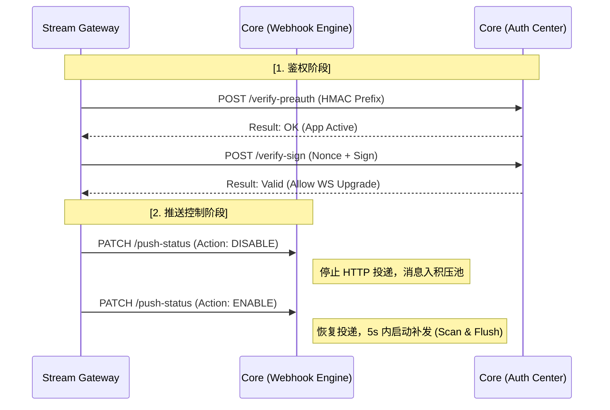

# 畅捷通 Core 服务配套改造需求 (PR v0.5)

> 本文档为《畅捷通 Stream Gateway 产品需求文档 v0.1.0》的配套附件，描述畅捷通核心服务（Core Service / Webhook 引擎）需要进行的配套改造内容。

| 协作项 | 描述 | 优先级 |
| --- | --- | --- |
| **项目名称** | 畅捷通 Stream Gateway 基础设施配套 | **P0** |
| **主要目标** | 升级 Webhook 引擎，支持在线鉴权验证、动态推送控制及消息幂等标识 | **核心任务** |

---

## 1. 业务交互图示 (Sequence & Logic)

### 1.1 在线鉴权与动态控制流

核心服务（Core）作为身份凭证（Secret）的唯一持有方，需支撑网关的建连验证及推送状态切换。



---

## 2. 身份验证 API 需求 (Auth Provider)

由于网关采用 **No-Secret 模式**（内存不存密钥），Core 需提供高性能验证接口。

### 2.1 验证 PreAuth 前缀

- **用途**：网关在处理 `/challenge` 接口时，初步过滤非法请求。
- **接口**：`POST /internal/v1/auth/verify-preauth`
- **参数**：

```json
{
  "app_key": "string",
  "pre_auth_prefix": "string(16位)"
}
```

- **逻辑**：Core 检索 Secret，计算 HMAC 后对比前 16 位。
- **响应要求**：需包含 App 状态（禁用/欠费等）。

### 2.2 验证 WebSocket 签名

- **用途**：WebSocket 建连时的最终身份确认。
- **接口**：`POST /internal/v1/auth/verify-sign`
- **参数**：

```json
{
  "app_key": "string",
  "nonce": "string",
  "sign": "string"
}
```

- **逻辑**：Core 计算 `HMAC_SHA256(app_key + "&" + nonce, AppSecret)`，与客户端提交的 `sign` 进行比对。
- **性能**：该接口位于建连关键路径，**P99 响应必须 < 50ms**。

---

## 3. 推送控制 API 需求 (Push Control)

支持网关根据 ISV 在线情况动态挂起或恢复投递。

### 3.1 推送状态切换

- **接口**：`PATCH /internal/v1/subscriptions/{app_key}/push-status`
- **请求 Body**：

```json
{
  "action": "DISABLE" // 或 "ENABLE"
}
```

- **动作定义**：

    - **DISABLE**：
        1. 停止向网关发起新的 Webhook HTTP 请求。
        2. 新产生的消息进入离线积压池，不可丢失。

    - **ENABLE**：
        1. 恢复该应用的 Webhook 推送。
        2. 在 **5s 内** 启动积压消息扫描补发（Scan & Flush）。

---

## 4. Webhook 投递协议升级 (Webhook Engine)

为了配合网关的幂等与容忍期逻辑，Core 侧投递引擎需做以下调整：

### 4.1 引入 `X-MSG-ID` (DEP-01)

- **优先级**：**P0**
- **需求**：在 Webhook 的 HTTP Headers 中必须包含 `X-MSG-ID`。
- **规则**：同一业务消息在重试（Retry）过程中，`X-MSG-ID` 必须保持 **全局唯一且绝对不变**。
- **用途**：ISV 客户端据此实现幂等。

### 4.2 TraceID 复用 (DEP-02)

- **优先级**：**P0**
- **需求**：重试请求必须复用首次生成的 `trace_id`（即 `X-Trace-Id` Header）。
- **用途**：用于全链路追踪，确保同一消息在多次投递中可被聚合。

### 4.3 保持 Payload 稳定性

- **需求**：Core 必须保证同一消息在多次重试投递时，Body 字符串内容完全一致。
- **原因**：防止 JSON 序列化（如 Key 顺序改变）导致签名校验失败。

### 4.4 Content-Type 确认 (DEP-03)

- **优先级**：**P1**
- **需求**：确认 Webhook `Content-Type` 是否固定为 `application/json`，以便网关和客户端可做相应的格式预期。

---

## 5. URL 自动验证支持

- **需求**：Core 在进行 Webhook URL 激活验证（`check_code`）时，需允许 Stream Gateway 代理响应。
- **逻辑**：若订阅模式为"Stream"，Core 应忽略对该 URL 的 `GET` 存活性强制校验，或由网关侧拦截并统一返回校验成功。

---

## 6. 性能与可靠性要求 (SLA)

1. **高并发支持**：推送控制接口（Enable/Disable）需支持在高频断连场景下的并发请求，避免竞态条件。
2. **重试一致性**：Core 在进行衰减重试时，必须复用首次生成的 `X-Trace-Id`。
3. **持久化保证**：进入 `DISABLE` 状态期间，积压消息不可丢失，直至达到 **24 小时过期阈值**。

---

## 7. 交付清单 (Deliverables)

| 编号 | 交付内容 | 验收标准 |
| --- | --- | --- |
| **01** | 在线验证接口 (`verify-preauth` / `verify-sign`) | 网关可通过 API 实时验证 ISV 签名，无 Secret 存储。P99 < 50ms。 |
| **02** | 推送开关逻辑 (`push-status`) | 接收网关指令并能正确挂起/恢复特定 App 的 Webhook 流。 |
| **03** | 补发机制 | 恢复推送后，积压的消息能在 5s 内启动下发至网关。 |
| **04** | Header 升级 (`X-MSG-ID`) | Webhook 请求头 100% 包含 `X-MSG-ID`，且重试不变。 |
| **05** | TraceID 复用 | 重试请求 100% 复用首次 `X-Trace-Id`。 |
| **06** | URL 验证兼容 | Stream 模式下的 Webhook URL 可正常激活。 |

---

## 8. 跨团队依赖事项汇总

| 编号 | 依赖事项 | 优先级 | 状态 |
| --- | --- | --- | --- |
| **DEP-01** | Core Webhook 请求头中增加全局唯一 `X-MSG-ID` | **P0** | 待开发 |
| **DEP-02** | 确认 Core 重试时 `trace_id` 是否复用 | **P0** | 待确认 |
| **DEP-03** | 确认 Webhook `Content-Type` 是否固定为 JSON | **P1** | 待确认 |
| **DEP-04** | Core 提供 `verify-preauth` API | **P0** | 待开发 |
| **DEP-05** | Core 提供 `verify-sign` API | **P0** | 待开发 |
| **DEP-06** | Core 提供 `push-status` 控制 API | **P0** | 待开发 |
| **DEP-07** | Core 支持离线消息积压池与补发 | **P0** | 待开发 |

---

**PR 提交人**：架构组

**审批人**：核心服务部 / 开放平台组

**生效日期**：202X-XX-XX
