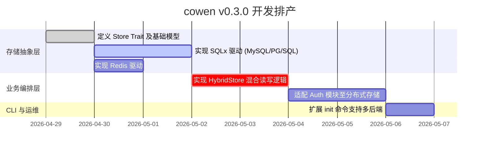

# 项目排产甘特图 (Gantt Chart)

```mermaid
gantt
    title cowen v0.3.0 开发排产
    dateFormat  YYYY-MM-DD
    section 存储抽象层
    定义 Store Trait 及基础模型 :done, T1, 2026-04-29, 1d
    实现 SQLx 驱动 (MySQL/PG/SQL) :active, T2, 2026-04-30, 2d
    实现 Redis 驱动 :T3, after T1, 1d
    section 业务编排层
    实现 HybridStore 混合读写逻辑 :crit, T4, after T2, 2d
    适配 Auth 模块至分布式存储 :T5, after T4, 2d
    section CLI 与运维
    扩展 init 命令支持多后端 :T6, after T5, 1d
```

## 关键路径 (Critical Path)
`T1 -> T2 -> T4 -> T5 -> T6`

---
*关联 LLD：[静态依赖视图](../../lld/sections/01-structure.md)*
